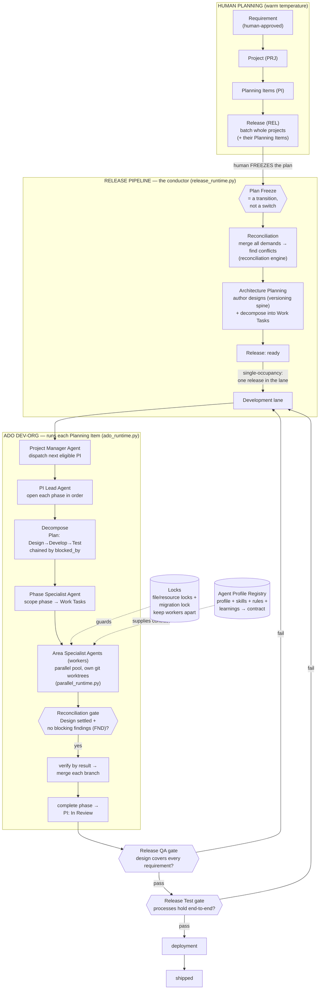

# Agent System — Overview (explain it simply)

> **What this is.** CRMBuilder v2 can build parts of *itself*. It has a small
> organization of AI "agents" — like a software company with managers, leads,
> and specialists — that take a planned piece of work and carry it from an idea
> all the way to shipped, tested code. This document explains, in plain
> language, what those agents are and how a piece of work travels through them.
>
> **Audience.** A smart person who knows nothing about this system.
> **Companion:** for exact code paths, status enums, and component internals,
> read `Agent-System-Technical-Reference.md` in this same folder.
>
> **Two names you'll see a lot.** **ADO** = *Agent Delivery Organization*, the
> org of agents that builds one planned item at a time. **Release pipeline** =
> the bigger machine that batches many planned items into a single shipped
> release and runs the whole org safely. The ADO sits *inside* the release
> pipeline.

---

## 1. The story, told as a software company

Imagine a small software company that ships **planned releases** (not a constant
trickle of tiny changes). Here is everyone who works there and what they do.

**The humans do the thinking up front.** A person decides *what to build* and
writes it down as **requirements** (plain-language statements of "we need X, and
here's why"). Nothing gets built until a human has approved a requirement — this
is a hard rule. The humans also group work into **Projects** (long-running
themes); inside each project are **Planning Items (PIs)** — one Planning Item is
a single unit of work to build (think of an item on a to-do list). When it's
time to ship, the humans choose which whole **Projects** go into the next
**Release**, and each project carries its Planning Items along.

**Then a human "freezes the plan."** Freezing is the moment the humans hand the
work off to the machine. Before the freeze, planning is loose and people can
work on anything in parallel. After the freeze, the rules get strict: work
happens in a careful order so two workers never trip over each other. (This
strict-after-freeze idea is called the **two temperatures** — warm and loose
before, cold and orderly after.)

**Now the AI org takes over.** Picture four levels of staff:

```
Project Manager Agent     →  picks the next ready Planning Item, hands it to a Lead
   PI Lead Agent          →  runs one Planning Item through its phases, in order
      Phase Specialist Agent  →  decides the to-do list for one phase
         Area Specialist Agent  →  actually does one item on that list
```

**All four levels are AI agents — software, not people.** The humans already did
their part (writing and approving the requirements, grouping the work, and
freezing the plan); from the freeze onward this whole org runs by itself, and a
human is only pulled back in when an agent raises a `needs_attention` flag. So
"Project Manager Agent," "PI Lead Agent," and so on are roles played by AI
programs, not job titles for staff.

> **Naming convention.** Every agent's name ends in the word **"Agent"** —
> Project Manager Agent, PI Lead Agent, Phase Specialist Agent, Area Specialist
> Agent, and so on. The rule cuts both ways: if a name does *not* end in
> "Agent," it is *not* an agent. (For example, the **runtime/conductor** is a
> program that *spawns* agents but is not itself one, so it carries no "Agent"
> suffix.)

- A **Project Manager Agent** (the top tier) looks at all the Planning Items in a
  project, figures out
  which one is ready to start (its prerequisites are done), and hands it to a Lead.
- A **PI Lead Agent** takes one Planning Item and walks it through a fixed sequence of
  **phases**: first *Design* (figure out exactly what to build), then *Develop*
  (write the code), then *Test* (prove it works).
- For each phase, a **Phase Specialist Agent** writes the to-do list — it breaks the
  phase into small, single-topic **Work Tasks** (e.g. "add the database column,"
  "add the API endpoint," "add the screen").
- An **Area Specialist Agent** is the worker who actually does one Work Task. Each one
  is a real AI coding agent that gets its own private copy of the codebase (a
  git "worktree"), does its one task, and its work is checked and merged in.

**A coherence check before building.** When the Design phase finishes, the
system pauses to look for places where the separate design decisions don't fit
together. Any problem it finds is written down as a **finding** (like a
sticky-note bug: "these two designs contradict each other"), and while a serious
("blocking") finding is open, the Develop phase is held until it's resolved. This
is the **reconciliation gate**. (In practice the gate today is modest — it mainly
confirms the Design step is finished and that no blocking finding is open; the
deeper, automatic cross-area coherence checking is still mostly a goal, not yet
fully built. See §4.)

**Workers don't collide.** Because many workers can run at once, the system has
**locks**: a worker "checks out" the files it's going to touch (like checking a
library book out), and nobody else can touch those files until it's done. There's
also a special **migration lock** that pauses everyone whenever the database
shape needs to change, so that risky step happens alone.

**Shipping.** Once all the Planning Items in a release are built, the release goes through
two big gates: a **QA gate** (does the design cover every requirement, with no
contradictions?) and a **Test gate** (do the real end-to-end processes work?).
Pass both, and the release is **shipped**.

**The org has a memory.** Behind all of this is the **Agent Profile Registry** —
the company's HR file and playbook combined. It stores, for each kind of worker,
their job description, the tools they may use, the rules they must follow, and
the **learnings** they've picked up over time ("last time we did a migration,
watch out for X"). When a worker is spawned, the registry hands it a **contract**
— exactly who it is and what it knows — assembled fresh each time.

**The conductor.** Tying it together is the **runtime** (the "conductor"). It's
not a person; it's a program that walks the release through its stages, spawns
the right agent at the right moment, runs the gates, and stops to ask a human
whenever something needs attention. Importantly, every agent is **spawned on
demand**: there are no agents sitting around running all day. "Standing" just
means *the registry remembers who you are*; the agent itself is started fresh,
reads its job and memory from the database, does its bit, writes back, and exits.

---

## 2. The flow, in one picture



*(If a release fails QA or Test it "bounces back" to Development and must pass
both again — nothing ships unverified.)*

*(**About the two "decompose" steps.** There are two ways work runs. In a
**release-driven** run — the main path — decomposition and scoping happen up
front, during Architecture Planning; the ADO then simply **executes** the
already-scoped Work Tasks. In a **standalone** ADO run (one Planning Item, no
release), the ADO does the decompose + scope steps itself, exactly as drawn in
the lower box. So the `Decompose`/`scope phase` steps in the lower box and the
"decompose into Work Tasks" in Architecture Planning are the **same work done in
one place or the other**, never both.)*

---

## 3. How the pieces sit together (the one-paragraph version)

The **runtime/conductor** programs walk the work through its stages. The
**release pipeline** (`release_runtime.py`) is the outermost loop; for each
Planning Item it calls the **ADO PI driver** (`ado_runtime.py`); the PI driver
runs each phase as a **parallel pool of worker agents** (`parallel_runtime.py`),
which is built on top of a simpler **serial loop** (`coordinating_runtime.py`).
The **registry** sits to the side and hands every spawned worker its contract.
The **locks** sit underneath the worker pool, keeping parallel workers from
editing the same files. The **reconciliation gate** sits at the Design→Develop
boundary inside the ADO, and the bigger **reconciliation engine** sits at the
release's planning stage. The **findings** are the gate's currency.

---

## 4. Honest notes on "built vs designed"

This system grew over many months and not everything in the design docs is
fully wired. The verified, *built* spine is: the four-tier substrate, the three
runtimes + release runtime, decomposition/scoping, the gate model, the
Design→Develop reconciliation gate with findings, the locks, the release entity
with its 12-state pipeline, and the registry (resolver + lifecycle). What is
**partial or thin** today (true as of the live DB on 2026-06-20):

- The registry is built but **lightly populated** — 5 agent profiles, 23 tool
  skills, 18 rules (only 1 enforced), and just 1 learning. The "living knowledge
  base that gets smarter every release" is mostly *capacity*, not yet *content*.
- The **matrix org** (per-area Architect Agent / Developer Agent / Tester Agent experts, cross-PI
  coordination, standing learning experts) is the **design direction**
  (`agent-delivery-organization-evolution.md`); the *built* runtime still drives
  the older four-tier PM→Lead→Phase→Area shape with a single generic worker
  prompt reused across areas.
- The reconciliation gate that runs today is the **within-PI Design→Develop**
  gate; the **cross-area** coherence reconciliation described in the evolution
  doc is largely aspirational.

The Technical Reference marks each component "verified in code" vs "designed."

---

## 5. Glossary (every term, explained as if to a five-year-old)

Ordered so you can read top to bottom: the big ideas first, then the org, then
the named "things" (entities), then the verbs and the safety mechanisms. An
alphabetical index is at the very end.

### The big ideas

- **Agent.** A helper robot. You give it a job and a set of instructions, it does
  the job by itself, then stops. Here, most agents are AI programs that write or
  check code.
- **ADO (Agent Delivery Organization).** The little company of robot helpers that
  builds one Planning Item at a time. Like a toy factory with a boss, team
  leaders, and workers. *(It used to be called the "Agent-Delivery Runtime" — same thing, nicer
  name.)*
- **Release pipeline.** The bigger assembly line that bundles lots of Planning
  Items into one big delivery and makes sure the robots don't bump into each other. The toy
  factory (ADO) works *inside* this assembly line.
- **Runtime / scheduler / conductor.** The program that says "you go now, you go
  next" — like the conductor of an orchestra waving the baton. It starts each
  robot at the right time and checks their work. Nobody is "the runtime"; it's
  just software running the show.
- **Engagement.** Which customer we're working for right now (like CRMBuilder
  itself, or the client "CBM"). Everything is tagged with the customer's name so
  work for different customers never gets mixed up. You tell the system the
  customer by adding a name tag (`X-Engagement`) to every request.

### The org (who the agents are)

*(Everyone in this section is an **AI agent — software, not a person.** The "boss"
and "team leader" are roles played by programs. Humans only plan the work up
front and step back in when an agent asks for help via `needs_attention`.)*

- **Agent tier.** Which level of the AI org an agent is — boss, team leader,
  list-maker, or worker. Higher tiers decide; lower tiers do.
- **Project Manager Agent (PM).** An AI agent — the top tier (not a human). The
  "boss" of one project: looks at all the Planning Items, picks the next one
  that's ready, and hands it to a team leader. Like the person who decides which
  chore the family does next, except it's automated.
- **PI Lead Agent.** An AI agent — the team leader for one Planning Item. Walks it
  through its steps in order — first plan it, then build it, then test it.
- **Phase Specialist Agent.** An AI agent that writes the to-do list for one step.
  It breaks a big step into small **Work Tasks** anyone can pick up.
- **Area Specialist Agent.** An AI agent — the worker that actually does one **Work
  Task** from the list.
  Each worker gets their own desk (a private copy of the code) so they don't
  scribble on someone else's work.
- **Architect Agent / Developer Agent / Tester Agent.** A newer plan for splitting
  up the workers by skill: the **Architect Agent** decides exactly what to build,
  the **Developer Agent** writes the code, and the **Tester Agent** checks it works
  *without peeking* at the Developer Agent's code (so the check is honest). *(In
  the older plan, the "Phase Specialist Agent" grew into the "Architect Agent" and
  the "Area Specialist Agent" grew into the "Developer Agent"; the "Tester Agent"
  is brand new.)*
- **Orchestrator.** An older word for the conductor — the program that hands out
  tasks and collects the finished work. (Per the naming convention, it has no
  "Agent" suffix because it is the *scheduler that spawns* agents, not an agent
  itself.) The first version of it (the "Parallel Agent Orchestrator") was retired
  and replaced by the ADO.

### The "things" (entities the system keeps track of)

- **Project (PRJ).** A big, long-running theme of work, like "the kitchen
  remodel." It holds lots of smaller Planning Items. *(This used to be called a
  "Workstream" — confusingly, that word was then re-used for something else;
  see Workstream below.)*
- **Planning Item (PI).** One unit of work inside a project, like "install the
  new sink." It's the main thing the robots build — picture an item on a to-do
  list.
- **Workstream (WSK).** One *step* of a single Planning Item — Design, Develop, or Test.
  *(Yes, the word "Workstream" was recycled: it used to mean the big theme that's
  now called a Project.)*
- **Work Task (WTK).** One tiny single-topic to-do inside a step, like "tighten
  the left bolt." A worker claims it and does it. **Area** says which kind of
  work it is (database, screen, etc.).
- **Work Ticket (WT).** A note that kicks off a work *session* and points to the
  full instructions. Different from a Work Task — this one is about starting a
  conversation, not doing a build step.
- **Release (REL).** A bundle of finished Planning Items that ship together, like packing
  several wrapped presents into one box to deliver at once.
- **Finding (FND).** A sticky-note that says "uh oh, these two plans don't agree"
  or "something's missing." A **blocking** finding stops the build until someone
  fixes it; an **advisory** one is just a heads-up.
- **Area.** The *kind* of work a task is. **System areas** are the fixed list
  baked into the code (database, screen, API, etc.). **Engagement areas** are
  extra kinds a specific customer adds for themselves.
- **Phase / pass.** The big steps a Planning Item goes through: **Plan**, **Design**,
  **Develop**, **Test**. (Today the build steps are named Design → Develop →
  Test; "Plan" is the act of making the to-do list.) *(An older version had six
  steps with different names like "Architecture," "Documentation," and
  "Deployment.")*
- **Agent Profile Registry.** The company's filing cabinet of job descriptions,
  tools, rules, and lessons-learned for every kind of worker. It's how a robot
  knows who it is and what it's allowed to do.
- **Agent profile (AGP).** One worker's job description in the cabinet — "you are
  the database Architect Agent."
- **Skill (SKL).** A thing a worker knows how to do (an instruction) or a tool
  it's allowed to use.
- **Governance rule (GVR).** A rule a worker must follow. Some are just advice
  ("advisory"); some are hard rules ("enforced") that block the work if broken.
- **Learning (LRN).** A lesson the workers picked up from doing real work, like
  "remember the oven runs hot." The more times it proves true, the more the
  system trusts it (its **confidence** goes up).
- **Contract / version stamp.** The exact instruction sheet a worker gets when
  it starts: its job description + tools + hard rules + remembered lessons. The
  **version stamp** is a little code-number that says "this exact instruction
  sheet, this version," so you can tell if it changed.
- **Close-out payload.** A tidy bundle of paperwork written at the end of a work
  session that records everything that happened (what was decided, what was
  built). Used mainly when the AI can't write to the database directly.
- **Deposit event.** The receipt printed when that paperwork is filed — proof, in
  writing, that the records were saved.

### The verbs (what agents do)

- **Decomposition.** Breaking one Planning Item into its steps (Design, Develop, Test) and
  saying which must come first. Like splitting "make breakfast" into "crack eggs
  → cook eggs → serve."
- **Scoping.** Writing the to-do list for one step. If a step turns out to have
  nothing to do, you mark it **Not Applicable** (you *looked* and there was
  genuinely nothing — that's different from skipping it).
- **Dispatch.** The boss officially starting a Planning Item and handing it down. "Okay,
  begin this one."
- **Claim.** A worker grabbing a task so it's *theirs* and nobody else takes it.
  Like putting your name on the sign-up sheet.
- **Release (the action).** Letting go of a task or a lock you were holding, so
  someone else can take it. *(Careful: same word as the noun "Release" above, the
  bundle of work — context tells you which.)*

### The safety mechanisms (how nobody collides)

- **blocked_by.** A "wait for this first" arrow between two Planning Items (or
  steps, or tasks). It makes sure things happen in the right order.
- **Gate model.** Each Planning Item, step, and task has a list of allowed moves between
  states (like a board game where you can only move along certain lines). You
  can't skip ahead; a "gate" checks the rules before you move.
- **needs_attention.** A flag a robot raises to say "a human should look at
  this." The most important "help!" signal in the whole system.
- **Reconciliation.** Checking that all the separate plans actually fit together
  before building, and sorting out any clashes.
- **Reconciliation gate.** The checkpoint between Design and Develop: you only
  start building once the design is settled and there are no blocking findings.
- **Reconciliation engine.** The math part that merges everyone's requested
  changes into one clean change-list and flags any spot where two changes
  disagree (a **conflict**). It always gives the same answer for the same input.
- **Conflict.** When two requested changes want the *same little detail*
  (a **facet**, like "is email required?") to be two different things. A human
  decides; the machine never guesses.
- **Plan freeze.** The moment a human locks the plan and hands it to the robots.
  It's a *step you take*, not a switch on an object — like ringing a bell to
  start the race.
- **Two-temperature planning.** Before the freeze, planning is warm and loose
  (work on anything, in parallel). After, it's cold and orderly (one thing at a
  time, in order). This stops workers from clobbering each other.
- **Area reopen.** If a finished, frozen step turns out to need changes, you
  carefully "reopen" it — pause the steps that came after, fix it, freeze it
  again, then continue. Plans themselves are never reopened; a plan change
  becomes a brand-new Release.
- **Cascade revalidation.** After a reopen, everything *downstream* has to be
  re-checked, because changing an early thing might have broken a later thing.
  The set of things affected is the **blast radius**, and a bigger blast radius
  needs a more senior person to approve the reopen.
- **Single-occupancy / exclusive lane.** Only one Release is allowed in the
  "building" lane at a time — like only one car on a one-lane bridge.
- **File lock / resource lock.** A worker "checks out" the files it will edit so
  nobody else can touch them, like checking a book out of the library. When
  done, it checks them back in.
- **Migration lock.** A special pause-everyone lock used only when the database's
  shape changes, so that risky step runs completely alone.
- **Spawn-on-demand.** Robots aren't left running. Each is started fresh for its
  task, reads its job and memory from the database, does the work, and switches
  off. "Standing" just means the database remembers who it is.
- **Versioning spine.** The system keeps a numbered snapshot of every design each
  time it changes, tagged with the release that made the change. A snapshot only
  counts as the "live" official one once its release has actually shipped.

### Alphabetical index of acronyms

| Acronym | Means | One-liner |
|---|---|---|
| **ADO** | Agent Delivery Organization | The org of robot helpers that builds a Planning Item. |
| **AGP** | Agent profile | One worker's job description in the registry. |
| **FND** | Finding | A sticky-note: a clash or gap in the plans. |
| **GVR** | Governance rule | A rule a worker must follow (advice or hard). |
| **LRN** | Learning | A lesson the workers remembered from real work. |
| **PI** | Planning Item | One unit of work inside a project. |
| **PM** | Project Manager Agent | The boss who picks the next Planning Item. |
| **PRJ** | Project | A big long-running theme of work. |
| **QA** | Quality Assurance | The gate checking the design covers everything. |
| **REL** | Release | A bundle of finished Planning Items that ship together. |
| **SKL** | Skill | Something a worker knows or a tool it may use. |
| **WSK** | Workstream | One step (Design/Develop/Test) of a Planning Item. |
| **WT** | Work Ticket | A note that kicks off a work session. |
| **WTK** | Work Task | One tiny single-topic to-do a worker claims. |

---

## Sources

This overview was reconciled against code and the live database, not just the
design docs. Drawn from:

**Code (ground truth):**
- `crmbuilder-v2/src/crmbuilder_v2/runtime/` — `ado_runtime.py`,
  `coordinating_runtime.py`, `parallel_runtime.py`, `release_runtime.py`,
  `dispatcher.py`, `migration_lock.py`, `reconciliation.py`, `release_gate.py`,
  `sub_agent_locks.py`, `agent_runtime.py`.
- `crmbuilder-v2/src/crmbuilder_v2/access/repositories/` — `pm.py`, `lead.py`,
  `decomposition.py`, `scoping.py`, `workstreams.py`, `work_tasks.py`,
  `findings.py`, `releases.py`, `release_demands.py`, `artifact_versions.py`,
  `registry_resolver.py`, `registry_lifecycle.py`, `registry_seed.py`.
- `crmbuilder-v2/src/crmbuilder_v2/access/` — `coordination.py`, `locks.py`,
  `reopen.py`, `planning.py`, `release_orchestration.py`, `vocab.py`.

**Live V2 DB** (`http://127.0.0.1:8765`, `X-Engagement: CRMBUILDER`, 2026-06-20):
`/projects`, `/releases`, `/agent-profiles`, `/skills`, `/governance-rules`,
`/learnings`, `/findings`, `/planning-items`, `/workstreams`, `/work-tasks`,
topic tree `TOP-005`.

**Archived design docs** (`PRDs/product/NEW-Master PRDs/Agent PRDs/Archive/`):
`agent-delivery-organization-design.md`, `agent-delivery-organization-evolution.md`,
`agent-pipeline-annotated-map.md`, `multi-agent-release-pipeline-architecture.md`,
`release-pipeline-agent-layer-architecture.md`, the `pi-203…216` architecture
docs, `pi-122-agent-profile-registry-architecture.md`, the registry PRD, and the
`governance-schema-specs/` entity specs.
